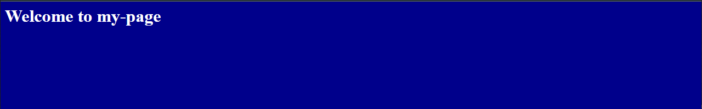

# vServer Setup

- Connection to your system with sshkey
- Install & setug nginx webserver
- Connect your system to GitHub

---

### 1. Connection to your system with sshkey

To use different keys on multiple systems, you can create a separate _subfolder_ for each _project_ to keep a better overview.

```bash
  mkdir ~/.ssh/subfolder
```

```powershell
  mkdir C:\Users\user\.ssh\subfolder
```

Create a new ssh-Key for remote connection to the server in a subfolder project/Specific

```bash
  ssh-keygen -t ed25519 -C "user@mail.com" -f ~/.ssh/subfolder/filename
```

```powershell
  ssh-keygen -t ed25519 -C "user@mail.com" -f C:\Users\user\.ssh\subfolder\filename
```

- `-t` **t**ype of Key you can also choose another one
- `-C` **C**omment to identify your key
- `-f` specifies the **f**ile path and name for storing the key file

You do not need to enter a passphrase and can skip entering it by pressing Enter. It is recommended to increase security.

```
  Enter passphrase:
```

> Now you have 2 new files in your folder
>
> - Private Key "filename" | **ONLY** for **YOU**
> - Public Key "filename.pub" | to share

---

#### Save the created key on the server

To do this, we copy the desired key to the server.

```bash
  ssh-copy-id vserver-user@vserver_ipv4
```

or

1. Copy the key to your server in the home directory of the server user

```powershell
  scp C:\Users\user\.ssh\subfolder\filename.pub user@vserver_ipv4:~
```

2. Login on your vServer with

```powershell
  ssh user@vserver_ipv4
```

3. Write your public-key in _authorized_keys_ flie

```powershell
  cat <filename.pub> >> .ssh/authorized_keys
```

4. Delete with remove your public-key file

```powershell
  rm ~/<filename.pub>
```

Print the contents of the file to check if everything worked.

```
  cat ~/ssh/authorized_keys
  ssh-ed25519 AAAAC3NzaC1lZFFAA13645B23AAAAIFE7TXS31fHp+/MbA4YlX4cG2OTQStMtX3R6+TDssBk0 user@mail.com

```

---

#### Check Connection

To test the login with the public key we connect to the server via sshkey.

```bash
  ssh -i ~/.ssh/subfolder/filename vserver-user@vserver_ipv4
```

```powershell
  ssh -i C:\Users\user\.ssh\subfolder\filename user@server_ipv4
```

- `-i` **i**dentity file by the path to your private key

or

#### Setup a short alias for connection

add to your local machine `./ssh/config` file

> ```
>  Host serverAlias
>    HostName hostname or IPv4
>    User user
>    IdentityFile ~/.ssh/subfolder/filename
> ```

```powershell
ssh serverAlias
```

---

#### Update vServer connection rules

Login with key & passphrase

```
ssh serverAlias
Enter passphrase for key 'C:\Users\user/.ssh/subfolder/filename':
```

Open the SSH configuration file with the text editor nano. You can only change the file if you have root rights.
To confirm root rights, enter the user password.

```
  sudo nano /etc/ssh/sshd_config
```

find PasswordAuthentication

```
#PasswordAuthentication yes
```

and change it to

```
PasswordAuthentication no
```

Save file & Exit nano

> save file STRG + O
> quit file STRG + X

To make the changes effective, the service must be restarted.

```
sudo systemctl restart sshd
```

---

# Nginx Webserver

Update your system

```bash
  sudo apt-get Update && sudo apt-get upgrade -y
```

Install nginx

```bash
  sudo apt-get install nginx -y
```

Open your browser an navigate to "http://server_ipv4", you can see the nginx.defautl webpage.

Delete the folder html with nginx.defautl.html

```bash
  sudo rm -r /var/www/html/
```

Create a new project folder

```bash
sudo mkdir /var/www/my_page
```

Create a index.html file in your project folder

```bash
sudo nano /var/www/my_page/index.html
```

```html
<html>
  <head>
    <title>MY_PAGE</title>
    <style>
      body {
        background-color: darkblue;
      }
      h1 {
        color: white;
      }
    </style>
  </head>

  <body>
    <h1 style="text-align=center;">Welcome to my-page</h1>
  </body>
</html>
```

Copy the default file to save the settings

```bash
  sudo cp /etc/nginx/sites-available/default /etc/nginx/sites-available/default_copy
```

remove file link

```bash
  sudo rm /etc/nginx/sites-enabled/default
```

rename the default file to my_page

```bash
  sudo mv /etc/nginx/sites-available/default /etc/nginx/sites-available/my_page
```

Open the my_page file with nano

```bash
  sudo nano /etc/nginx/sites-available/my_page
```

add your nginx webserver configuration

```javascript
server {
        listen 8081;

        root /var/www/my_page;

        index index.html;

        server_name 192.168.178.48;

        location / {
                # First attempt to serve request as file, then
                # as directory, then fall back to displaying a 404.
                try_files $uri $uri/ =404;
        }
}
```

Save file & Exit nano

> save file STRG + O
> quit file STRG + X

```bash
  sudo ln -s /etc/nginx/sites-available/my_page /etc/nginx/sites-enabled/
```

Test your nginx settings

```bash
  sudo nginx -t
```

```bash
  nginx: the configuration file /etc/nginx/nginx.conf syntax is ok
  nginx: configuration file /etc/nginx/nginx.conf test is successful
```

Adjust user rights for the project for nginx

```bash
  sudo chown -R www-data:www-data /var/www/my_page/
```

Restart Nginx service to apply the settings

```bash
  sudo systemctl restart nginx
```

Open your browser an navigate to "http://server\*ipv4:8010", now you can see your webpage.



---

### Connect your system to GitHub

Install Git on your server

```bash
  sudo apt-get install git
```

```bash

```
